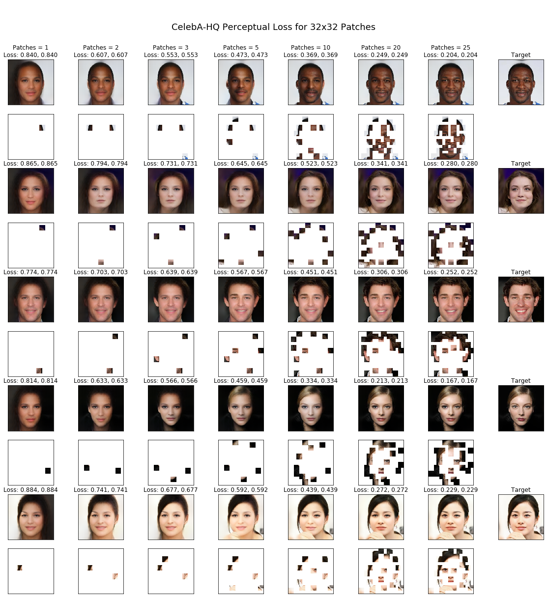

# ImageReconstuction
Computer Vision Research Project

[Paper](https://openreview.net/pdf?id=IQvu5_MY7aE) published in 2021 Neurips Workshop for Deep Generative Models and Downstream Applications

The goal is to train a model to reconstruct a face given a certain portion of a face. 
This portion is quantified as a patch, and the goal is to use as few patches to reconstruction the original image. 
A greedy approach is used to determine which patch locations are optimal for each image and the results are show down below.

The model consists of Unet architecture trained on a Perceptual Loss function based on VGG-16. 

